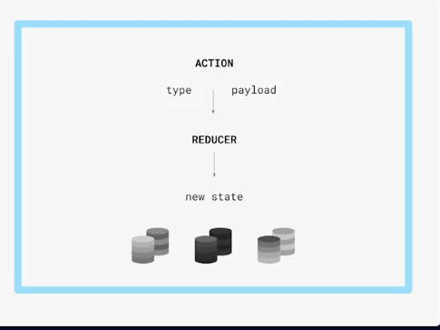
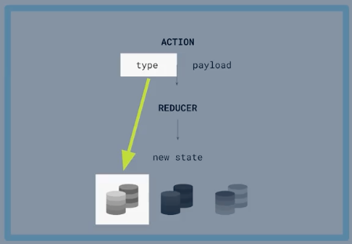
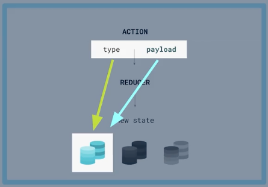
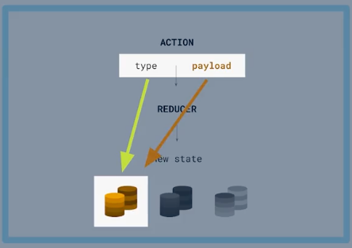

# State Management in React.js

In the course we will work in a Security Codes Projects

## What is a State

State is:
- data that change by user interaction.
- data property and handle it by the component owner.

## Independents and complex States

- Simples or Independents State
- Complex State: Always we need to use in Classes Components

## ¿What is a Reducer?

- The Reducer is a tool allows us to declare all the possible states of our application to be able to work with them declaratively way.
- the useReducer hook let us State management by declarative way

The Reducer need two principal objects:
1. Compound State: Is a literal Object where all our App States will live like object attributes
2. Actions: Are trigger allows us move of one State to another State and have two props:
    - Action Type: What is a _key name_ to find the new State and then update the App State. 
    - Payload: Is Optional but is important when we work dynamic States.

